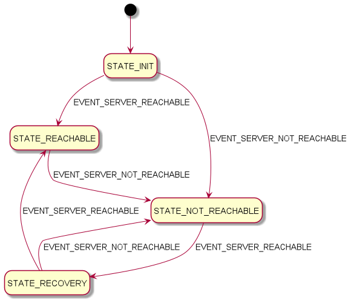

## Server connection with FSM

### Description

This application checks if a server is reachable, using a Finite State Machine (FSM) to update the different states.<br>
This FSM has 3 states (see diagram below):
- NotReachable: the server is not reachable
- Reachable: the server is reachable
- Recovery: the server was in NotReachable state, and the server is reachable


### Usage

```
//
// We start the FSM with Init state
//
ServerConnectionFsm.State currentState = ServerConnectionFsm.State.Init;

//
// if the server is reachable (from Init state)
// we go to the next state (Reachable)
//
assertEquals(state.next(true), ServerConnectionFsm.State.Reachable);

//
// if the server is NOT reachable (from Reachable state),
// we go to the next state (NotReachable)
//
assertEquals(state.next(false), ServerConnectionFsm.State.NotReachable);`

//
// if the server is reachable (from NotReachable state),
// we go to the next state (Recovery)
//
assertEquals(state.next(true), ServerConnectionFsm.State.Recovery);`

```

### Exposed endpoints
#### Default route
> `http://localhost:8080`
#### Shutdown server
> `http://localhost:8080/actuator/shutdown`
#### Check if server is available
> `http://localhost:8080/available`

### FSM with events
