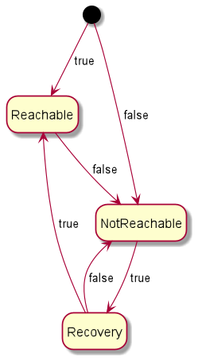

## Server connection with FSM

### Description

Check if a server is reachable or not, using a Finite State Machine (FSM).<br>
There are three states (see diagram below):
- NotReachable
- Reachable
- Recovery



### Usage

```
// example with the Initial state
CheckServerConnectionFsm.State currentState = CheckServerConnectionFsm.State.Init;

// if the server is reachable,
// then the transition is true,
// and we go to the next state (Reachable)
assertEquals(state.next(true), CheckServerConnectionFsm.State.Reachable);

// if the server is NOT reachable,
// then the transition is false,
// and we go to the next state (NotReachable)
assertEquals(state.next(false), CheckServerConnectionFsm.State.NotReachable);`
```